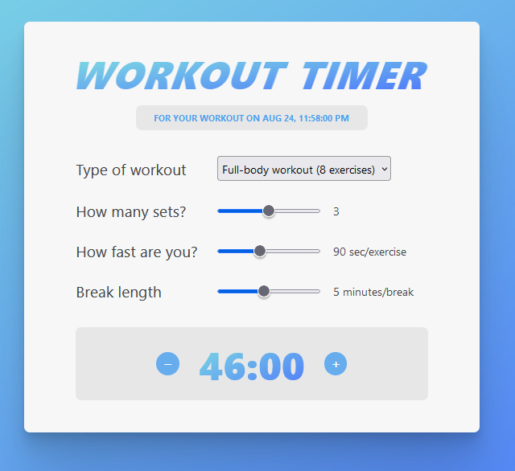

# React - Workout timer

# 🔗 [Live Preview](https://main--reliable-pudding-0aed7c.netlify.app/)

---

## About Project 👋

The Workout Timer App is a simple application designed to help users manage their workout routines. The app includes features such as a dynamic workout selection based on the time of day (AM/PM), a customizable exercise calculator, and the ability to toggle workout sounds on or off.

Created using create-react-app

---

## Features 👨‍💻

- **Dynamic Workout Selection**: The number of exercises in the workout changes based on the time of day (AM or PM).

- **Customizable Workout Parameters**: Users can adjust the number of sets, exercise speed, and break duration.

- **Sound Toggle**: Option to enable or disable sound effects during workouts.

- **Real-Time Clock**: Displays the current time in a formatted string, which updates every second.

---

## How it works ⚙️

### 1\. `App`

The main component that renders the entire application. It manages the overall state of the app, including the current time, whether sounds are allowed, and the dynamic list of workouts.

-   **State Variables**:

    -   `allowSound`: Controls whether sound effects are enabled or disabled.
    -   `time`: Tracks the current time and updates every second.
    -   `partOfDay`: Extracted from the current time to determine whether it's AM or PM.
-   **Usage**:

    -   Displays the workout timer and renders the `Calculator` and `ToggleSounds` components.
    -   Passes the necessary props to child components.

### 2\. `Calculator`

This component is responsible for calculating the workout duration based on user inputs, such as the number of exercises, sets, speed, and break length.

-   **Props**:

    -   `workouts`: An array of workout objects that dynamically change based on the time of day.
    -   `allowSound`: Controls whether sound effects are enabled when interacting with the calculator.
-   **State Variables**:

    -   `number`: The number of exercises selected by the user.
    -   `sets`: The number of sets for the workout.
    -   `speed`: The speed of each exercise in seconds.
    -   `durationBreak`: The length of breaks between sets in minutes.
-   **Features**:

    -   Calculates and displays the total workout duration based on user inputs.
    -   Allows the user to select different workout types, adjust the number of sets, exercise speed, and break length.

### 3\. `ToggleSounds` 

A simple button component that toggles sound effects on or off. **Notice: the ToggleSound feature is not working at the moment**

-   **Props**:

    -   `allowSound`: A boolean that controls whether sounds are enabled.
    -   `setAllowSound`: A function to toggle the `allowSound` state.
-   **Usage**:

    -   Displays an icon that changes based on whether sounds are enabled (`🔈` for sound on, `🔇` for sound off).

### 4\. `Clock` (Optional)

If using a separate `Clock` component, it would be responsible for displaying the current time and updating the `partOfDay` state in the `App` component.

---

## Technologies & Dependencies used 📦

- **React:** useState, useEffect, components, functions...

- **Styling:** Basic CSS

dependencies:

    "@testing-library/jest-dom": "^5.16.5",
    "@testing-library/react": "^13.4.0",
    "@testing-library/user-event": "^13.5.0",
    "react": "^18.2.0",
    "react-dom": "^18.2.0",
    "react-scripts": "5.0.1",
    "web-vitals": "^2.1.4"

devDependencies: none

---

## Prerequisites 📚

Ensure you have the following installed on your system:

    Node.js v18.00.0
    npm or yarn

---

## Clone & Run locally 🏃‍♂️

1. **Clone the Repository:**

   - On the GitHub repo page, click the green "Code" button.

   - Copy the HTTPS URL.

2. **Open the Terminal:**

   - Open the terminal by typing "cmd" in your desktop's start menu, **OR**

   - Right-click on the desktop and select "Git Bash Here" (if you have Git Bash installed), **OR**

   - Open Visual Studio Code's terminal by clicking "Terminal" -> "New Terminal" inside the editor.

3. **Navigate to Your Project Location:**

   - In the terminal, navigate to your desired location (e.g., desktop) using the command: `cd desktop`. Adjust the path if your project is located elsewhere.

   - Ensure that your terminal's address is inside the project folder.

4. **Clone the Repository:**

   - Run the command: `git clone /link/`. Replace `/link/` with the HTTPS URL from step 1.

5. **Enter the Project Directory:**

   - Navigate into the cloned repository by typing: `cd /folder-name/`. Replace `/folder-name/` with the name of the cloned folder.

6. **Install Dependencies:**

   - Run the command: `npm install` to install all the necessary dependencies.

7. **Start the Project:**

   - Run the command: `npm start` or `yarn start` to start the project. It will open in your default browser at [localhost:3000/](http://localhost:3000/)

---

## Project Structure 📂

    ├── public/ # Static files
    ├── src/
    │ ├── App.js
    │ ├── Calculator.js
    │ ├── index.css
    │ ├── index.js
    │ ├── ToggleSounds.js
    ├── package.json s
    └── README.md

---

## Contributing 💻

Contributions are closed

---
